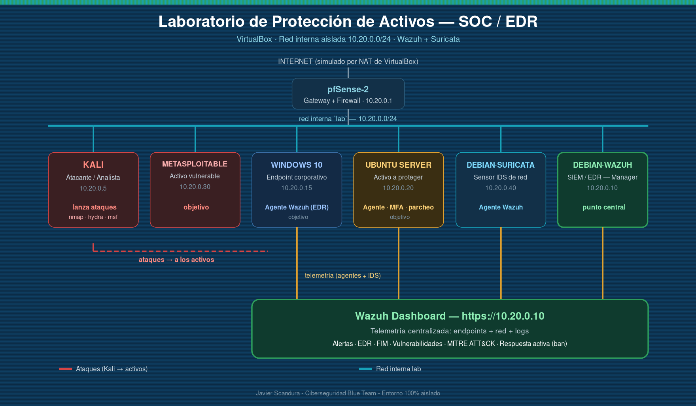

# 🛡️ Laboratorio de Protección de Activos — SOC / EDR con Wazuh + Suricata

> Laboratorio práctico **Blue Team** en VirtualBox que recrea el ciclo completo de una operación de protección de activos: **configurar la defensa → atacar → registrar toda la telemetría → visualizar → generar informe.** Usa equivalentes *open source* de herramientas comerciales (Cortex/EDR → **Wazuh**, DUO/MFA → **PAM+TOTP**, IDS → **Suricata**). Entorno **100 % aislado**.


**Autor:** Javier Scandura — Analista de Ciberseguridad (Blue Team)

---

## 📑 Tabla de contenidos

- [Objetivo](#-objetivo)
- [Arquitectura](#-arquitectura-red-interna-lab-1020024)
- [Inventario de máquinas](#-inventario-de-máquinas)
- [Mapa al puesto (qué demuestra)](#-mapa-al-puesto-qué-demuestra)
- [Recorrido rápido (los 3 actos)](#-recorrido-rápido-los-3-actos)
- [Contenido del repositorio](#-contenido-del-repositorio)
- [Cómo hacer la práctica](#-cómo-hacer-la-práctica)
- [Tecnologías](#-tecnologías)
- [Aviso legal](#-aviso-legal)

---

## 🎯 Objetivo

Demostrar, en un entorno reproducible y aislado, cómo una operación de protección de activos:

1. **Configura la defensa** para que los ataques se detecten y contengan (firewall, agentes EDR, IDS, MFA, respuesta activa).
2. **Ataca desde Kali** y comprueba que **todo queda registrado** (logs de endpoint, telemetría de red, alertas).
3. **Visualiza** la telemetría en el dashboard de Wazuh y **genera un informe** con las evidencias.

El resultado esperado de ese informe está en [`INFORME-Deteccion-y-Defensa.docx`](INFORME-Deteccion-y-Defensa.docx) como ejemplo de referencia.

---

## 🗺️ Arquitectura (red interna `lab` 10.20.0.0/24)



```
                 INTERNET (NAT de VirtualBox)
                          |  WAN DHCP
                  ┌───────┴────────┐
                  │   pfSense-2    │   GATEWAY + FIREWALL
                  │   10.20.0.1    │
                  └───────┬────────┘
        red interna `lab` — 10.20.0.0/24 (aislada)
   ┌──────────┬───────────┼───────────┬──────────────┬──────────────┐
 KALI .5   WAZUH .10   WINDOWS .15  UBUNTU .20   METASPLOIT. .30  SURICATA .40
 atacante  SIEM/EDR    agente EDR   agente+MFA   activo vuln.     IDS de red
 analista  Dashboard   (Windows)    +parcheo     (a escanear)     → Wazuh
                          │
              Wazuh Dashboard (https://10.20.0.10)
        alertas · EDR · FIM · IDS · vulnerabilidades · MITRE ATT&CK
```

**Idea clave:** Wazuh (10.20.0.10) es el **punto central** donde converge TODA la telemetría — logs de endpoints (agentes), alertas de red (Suricata) y eventos del firewall. Desde ahí se visualiza y se genera el informe.

---

## 🖥️ Inventario de máquinas

| VM (VirtualBox) | Rol en el lab | IP fija | RAM sugerida |
|---|---|---|---|
| **pfSense-2** | Gateway + firewall (NAT a Internet) | 10.20.0.1 | 1 GB |
| **kali-linux-2025.3** | Atacante / analista | 10.20.0.5 | 2 GB |
| **Debian 12 - Wazuh** | **SIEM / EDR — Manager + Dashboard** (núcleo) | 10.20.0.10 | 4 GB (mínimo) |
| **Windows 10 Markus** | Endpoint corporativo con agente Wazuh (EDR) | 10.20.0.15 | 2-4 GB |
| **UbuntuServer** | Activo a proteger: parcheo + MFA + agente Wazuh | 10.20.0.20 | 2 GB |
| **Metasploitable2** | Activo **vulnerable** (a escanear) | 10.20.0.30 | 512 MB-1 GB |
| **Debian 13 - Suricata** | Sensor **IDS de red** (telemetría → Wazuh) | 10.20.0.40 | 2 GB |

> **Arranque por RAM:** pfSense → Debian-Wazuh → el activo del módulo que estés haciendo → Kali. Windows y Suricata solo cuando toque su módulo.

---

## 🧩 Mapa al puesto (qué demuestra)

| Área del puesto | Implementación en el lab |
|---|---|
| EDR (Cortex/Trellix) | Wazuh Manager + agentes (Windows + Linux) |
| IDS / telemetría de red | Suricata → Wazuh |
| Gestión de vulnerabilidades | Nmap/OpenVAS + priorización CVSS |
| Parcheo y rollback | apt/unattended-upgrades + runbook + snapshot |
| MFA (DUO) | PAM + TOTP en SSH |
| FIM (integridad de ficheros) | Wazuh syscheck |
| Respuesta y contención | Wazuh active response (auto-ban) |
| Gestión de cambios (BAU) | Runbooks + change log |

---

## 🎬 Recorrido rápido (los 3 actos)

**ACTO 1 — Configurar la defensa:** Wazuh Manager + Dashboard, despliegue de agentes EDR (Windows/Linux), Suricata → Wazuh, FIM + respuesta activa, MFA (PAM+TOTP) en el activo Ubuntu.

**ACTO 2 — Atacar y comprobar registro:** escaneo de vulnerabilidades a Metasploitable, fuerza bruta SSH (con auto-ban), reconocimiento contra Windows, cambio no autorizado (prueba de FIM). Cada ataque genera telemetría en un plano distinto.

**ACTO 3 — Visualizar y reportar:** dashboard de Wazuh (Security events, FIM, Vulnerabilities, MITRE ATT&CK) y generación del informe con evidencias.

👉 Paso a paso completo en **[`GUIA-COMPLETA-Lab-Proteccion-de-Activos.md`](GUIA-COMPLETA-Lab-Proteccion-de-Activos.md)**.

---

## 📂 Contenido del repositorio

| Archivo | Descripción |
|---|---|
| [`GUIA-COMPLETA-Lab-Proteccion-de-Activos.md`](GUIA-COMPLETA-Lab-Proteccion-de-Activos.md) | Guía paso a paso (empieza aquí). |
| [`IPs-fijas-lab-VirtualBox.md`](IPs-fijas-lab-VirtualBox.md) | Configuración de red e IP fija por máquina. |
| [`PRACTICA.md`](PRACTICA.md) | **Retos guiados por acto** con niveles de dificultad (para el alumno). |
| [`RUBRICA-evaluacion.md`](RUBRICA-evaluacion.md) | **Rúbrica de evaluación** por competencias (para el instructor). |
| [`runbook-parcheo.md`](runbook-parcheo.md) | Procedimiento validado de parcheo con rollback. |
| [`runbook-respuesta-EDR.md`](runbook-respuesta-EDR.md) | Respuesta a alertas del EDR (ciclo NIST). |
| [`CHANGELOG-cambios.md`](CHANGELOG-cambios.md) | Registro documental de cambios del laboratorio. |
| [`INFORME-Deteccion-y-Defensa.docx`](INFORME-Deteccion-y-Defensa.docx) | Ejemplo de informe de resultados esperados. |
| `arquitectura-proteccion-activos.png` | Diagrama de arquitectura. |

---

## 🧪 Cómo hacer la práctica

1. Monta el laboratorio siguiendo la **[guía completa](GUIA-COMPLETA-Lab-Proteccion-de-Activos.md)** y las **[IPs fijas](IPs-fijas-lab-VirtualBox.md)**.
2. Abre **[`PRACTICA.md`](PRACTICA.md)** y resuelve los retos por acto (⭐ básico → ⭐⭐⭐ avanzado). Cada reto pide una **evidencia** concreta.
3. Documenta tus hallazgos y genera tu propio informe; compáralo con el **ejemplo de referencia** (`INFORME-Deteccion-y-Defensa.docx`).
4. El instructor evalúa con **[`RUBRICA-evaluacion.md`](RUBRICA-evaluacion.md)**.

---

## 🧰 Tecnologías

`Wazuh` · `Suricata` · `PAM + TOTP` · `Nmap/OpenVAS` · `apt/unattended-upgrades` · `pfSense` · `Kali` · `Windows 10` · `Metasploitable2` · `VirtualBox` · `MITRE ATT&CK`

---

## ⚖️ Aviso legal

Uso **estrictamente educativo**. Metasploitable es intencionadamente vulnerable: **no exponer a redes reales**. Realiza ataques **únicamente** contra las VMs propias de este laboratorio aislado. El autor no se responsabiliza del uso indebido de estos materiales.
